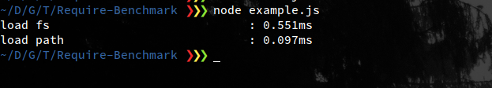

# Require Benchmark

[](https://travis-ci.org/TiagoDanin/Require-Benchmark) [](https://npmjs.org/package/require-benchmark) [](https://npmjs.org/package/require-benchmark) [](https://npmjs.org/package/require-benchmark) [](https://github.com/xojs/xo) 

Package loading time in NodeJs

<p align="center"></p>

## Installation

Module available through the [npm registry](https://www.npmjs.com/). It can be installed using the  [`npm`](https://docs.npmjs.com/getting-started/installing-npm-packages-locally) or [`yarn`](https://yarnpkg.com/en/) command line tools.

```sh
# NPM
npm install require-benchmark --save
# Or Using Yarn
yarn add require-benchmark
```

## Example

```js
// eslint-disable-next-line import/no-unassigned-import
require('require-benchmark') // First import
const fs = require('fs')
const path = require('path')

fs.readFileSync(path.resolve('package.json')).toString()
```

## Tests

To run the test suite, first install the dependencies, then run `test`:

```sh
# NPM
npm test
# Or Using Yarn
yarn test
```

## Dependencies

None

## Dev Dependencies

- [xo](https://ghub.io/xo): JavaScript happiness style linter ❤️

## Contributors

Pull requests and stars are always welcome. For bugs and feature requests, please [create an issue](https://github.com/TiagoDanin/Require-Benchmark/issues). [List of all contributors](https://github.com/TiagoDanin/Require-Benchmark/graphs/contributors).

## License

[MIT](LICENSE) © [Tiago Danin](https://TiagoDanin.github.io)